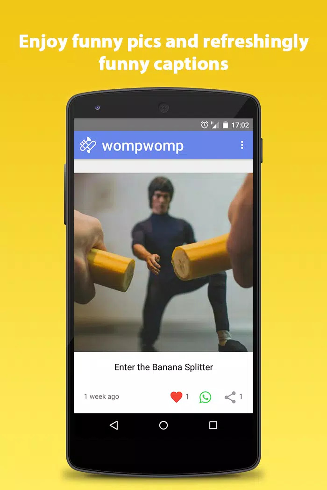
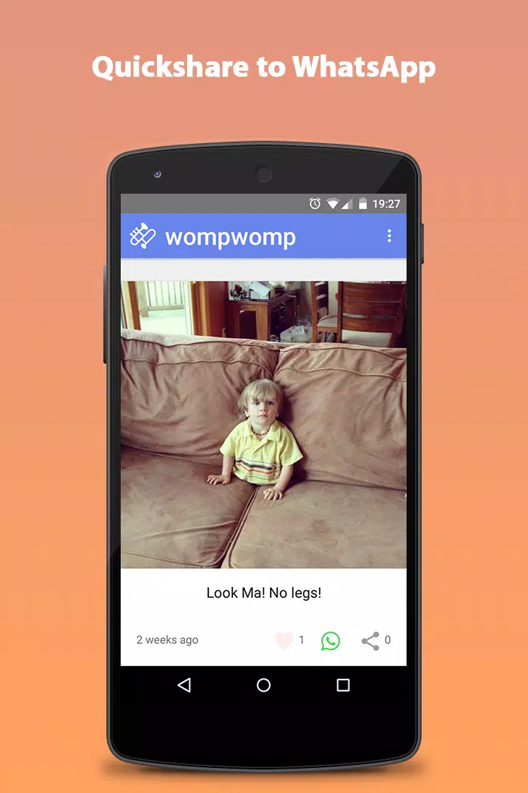
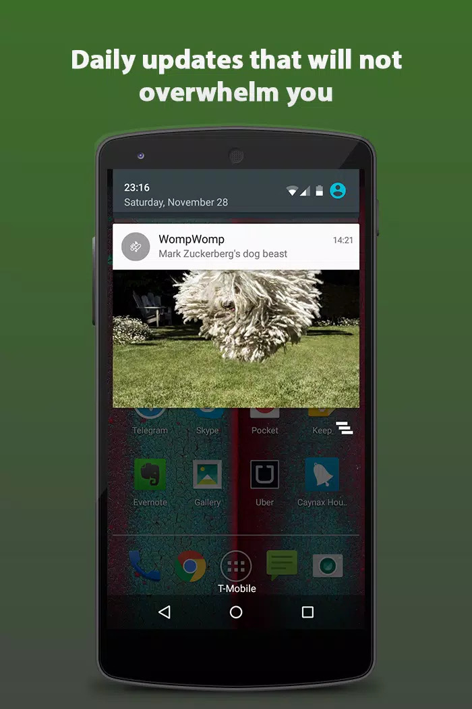
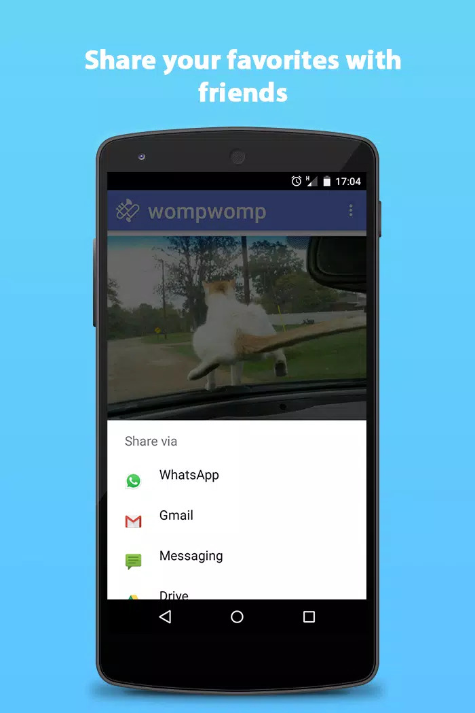
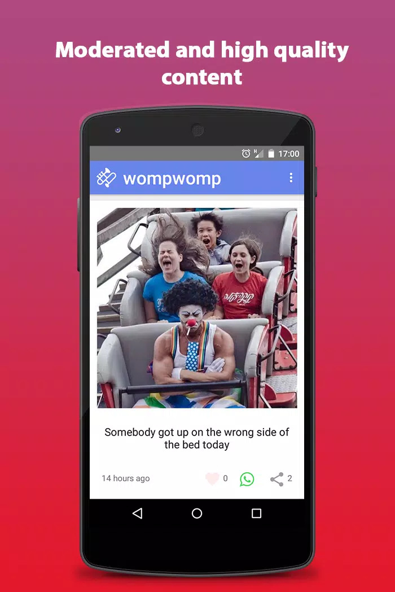

# Android app for WompWomp (Oct 2015 - Jun 2016)

## Intro
Wompwomp was an Android app and web app for viewing video and image memes. This repo is for the Android app codebase. The Android app was on the Play Store. The web app was hosted at https://wompwomp.co and was used mainly for uploading memes to the database.

## Usage
After installing the Android app, users could view memes without needing to sign in.

## Tech Stack
* Android app written initially in Java and refactored to Kotlin

## User base
WompWomp had 10K installs and hosted over 3000 pictures and video memes.

## Challenges
* poor retention
* no path forward — just an entertainment app
* not a solution to any pain point as such

### How to use the codebase ###
* Clone this git repo
* Install Android Studio and open it
* Open this git repo folder in Android Studio
* Build, install and run the app

### App visuals
Images from the Play store page

